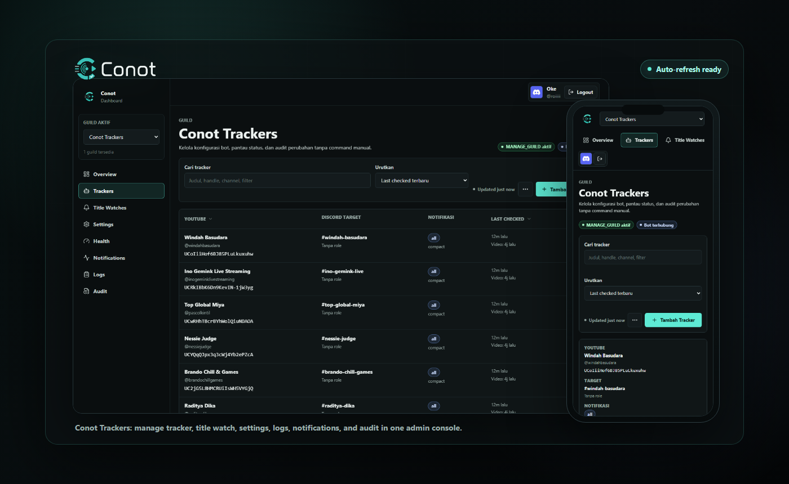
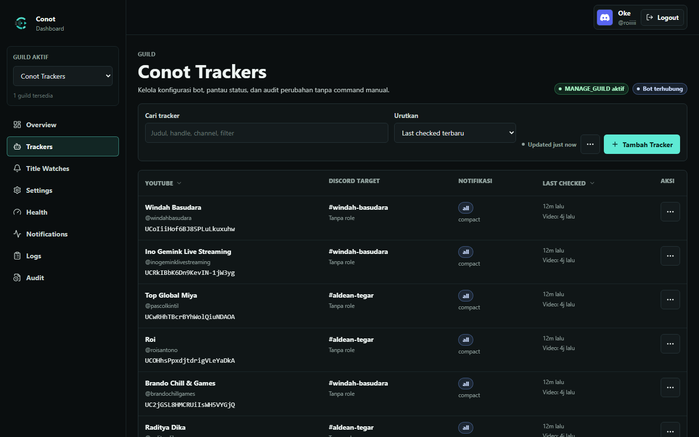
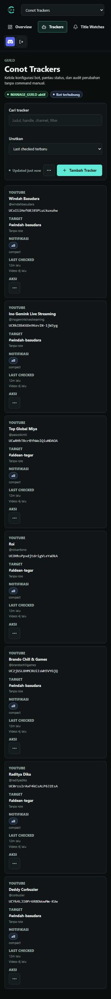

# Conot

Bot Discord modular untuk notifikasi YouTube berbasis `Node.js` dan `discord.js v14`, tanpa `YouTube Data API v3`.

Conot ditujukan untuk komunitas yang butuh notifikasi YouTube yang ringan, gratis, fleksibel, dan mudah dirawat.

## Legal

- [Terms of Service](TERMS_OF_SERVICE.md)
- [Privacy Policy](PRIVACY_POLICY.md)
- [License](LICENSE)

## Key Features

- Tracker channel YouTube berbasis RSS resmi
- Slash command dan prefix command
- Prefix kustom per server, default `?n`
- Filter konten: `all`, `video`, `shorts`, `live*`, `premiere*`
- Filter judul multi-keyword
- Title watch global berbasis keyword judul
- Custom message + ping role
- Layout embed `compact` dan `rich`
- Source tracker terkunci ke channel ID awal (anti drift), dengan opsi refresh eksplisit saat update
- Setup preview saat add tracker/title watch
- Log channel user untuk audit aksi admin + dev log global untuk error teknis yang actionable
- Polling RSS multi-item untuk mengurangi risiko miss saat burst upload
- Dedupe state + guard anti-spam
- Retry/backoff untuk RSS dan scraping YouTube
- Backup otomatis `data.json` + retensi backup
- Canary scheduler untuk mendeteksi dini kegagalan scraping YouTube
- Migrasi schema `data.json` otomatis via `dataVersion`
- Limit skala per guild (tracker/title watch) untuk mencegah abuse
- Guard whitelist guild dan whitelist user yang bisa diaktifkan sesuai kebutuhan
- Health/status command untuk cek runtime, poller, konfigurasi guild, memory usage, dan ukuran `data.json`
- Detail health internal (storage/backup/canary/guard) hanya tampil untuk owner instance
- Automated tests dasar via `node:test`

## Dashboard Preview



Dashboard web memakai gaya dark admin yang ringkas untuk mengelola tracker YouTube, title watch, settings, health, logs, notifications, dan audit tanpa command manual. Screenshot di bawah dibuat dari data mock lokal untuk dokumentasi, bukan data produksi.

<table>
  <tr>
    <td width="68%">
      
    </td>
    <td width="32%">
      
    </td>
  </tr>
</table>

## Tech Stack

- `Node.js >= 20.10.0`
- `discord.js v14`
- `axios`
- `rss-parser`
- `fs` untuk file database JSON

## Project Structure

```text
Conot/
|-- apps/
|   |-- bot/                # wrapper app untuk runtime bot existing
|   |-- dashboard-api/      # config service API + OAuth/RBAC gateway
|   `-- dashboard-web/      # web dashboard shell modular
|-- packages/
|   |-- shared-schema/      # contract validation lintas app
|   |-- shared-types/       # enum + response contract lintas app
|   |-- domain/             # pure business rules reusable
|   |-- config-client/      # SDK client untuk bot -> dashboard-api
|   `-- config/
|       |-- eslint/
|       `-- tsconfig/
|-- data/
|   `-- data.json
|-- config/
|   `-- app.config.json
|-- src/
|   |-- commands/
|   |-- config/
|   |-- events/
|   |-- services/
|   |-- utils/
|   `-- index.js
|-- .env.example
|-- pnpm-workspace.yaml
|-- turbo.json
|-- package.json
|-- PRIVACY_POLICY.md
|-- README.md
`-- TERMS_OF_SERVICE.md
```

## Quick Start

### 1. Install

```bash
npm install
```

### 1.5. Run basic tests

```bash
npm run lint
npm test
npm run test:coverage
npm run lint:secrets
```

### 2. Configure `.env` dan config

```env
# Secrets and deployment-specific overrides only.
# Operational defaults live in config/app.config.json.

DISCORD_TOKEN=your_discord_bot_token
GUILD_ID=
BOT_OWNER_IDS=YOUR_OWNER_USER_ID
GUARD_GUILD_IDS=
GUARD_USER_IDS=
EXTERNAL_LOG_WEBHOOK_URL=
DASHBOARD_SESSION_SECRET=replace-with-strong-secret
DASHBOARD_REDIS_URL=
DISCORD_CLIENT_ID=
DISCORD_CLIENT_SECRET=
CONFIG_SERVICE_TOKEN=replace-with-strong-token
CONOT_CONFIG_PATH=config/app.config.json
DASHBOARD_API_HOST=::
DASHBOARD_API_PORT=4310
DASHBOARD_API_BASE_URL=http://localhost:4310
DASHBOARD_WEB_HOST=::
DASHBOARD_WEB_PORT=4320
DASHBOARD_WEB_ORIGIN=http://localhost:4320
DASHBOARD_PUBLIC_URL=
DASHBOARD_AUTH_MODE=mock
DISCORD_REDIRECT_URI=http://localhost:4310/v1/auth/discord/callback
DASHBOARD_DEFAULT_RETURN_TO=http://localhost:4320/dashboard
DATA_FILE_PATH=data/data.json
DASHBOARD_SESSION_FILE_PATH=data/dashboard-sessions.json
DASHBOARD_CONFIG_STORAGE_DRIVER=json
DASHBOARD_SQLITE_FILE_PATH=data/dashboard-config.sqlite
```

Catatan:

- `DISCORD_TOKEN` wajib
- `GUILD_ID` opsional
- isi `GUILD_ID` jika ingin registrasi slash command lebih cepat ke satu server
- `BOT_OWNER_IDS` dipakai untuk owner instance yang boleh mengatur whitelist dan dev log global
- `.env` sekarang dipakai untuk secret dan override per deployment; default operasional ada di `config/app.config.json`
- nilai `.env` tetap menang atas `config/app.config.json`, jadi production bisa override tanpa mengubah file config versi repo
- `CONOT_CONFIG_PATH` opsional jika ingin memakai file config lain, misalnya `config/production.config.json`
- tuning seperti `DATA_BACKUP_*`, `RSS_*`, `MAX_*`, `CANARY_*`, `CONFIG_SYNC_*`, session TTL, rate limit dashboard, dan storage default sebaiknya diubah di `config/app.config.json`
- secret tetap harus di `.env`: `DISCORD_TOKEN`, `DISCORD_CLIENT_SECRET`, `DASHBOARD_SESSION_SECRET`, `DASHBOARD_REDIS_URL`, `CONFIG_SERVICE_TOKEN`, dan `EXTERNAL_LOG_WEBHOOK_URL`
- `GUARD_GUILD_IDS` dan `GUARD_USER_IDS` opsional untuk bootstrap whitelist dari environment
- jika `GUARD_USER_WHITELIST_ENABLED=true`, minimal isi satu owner di `BOT_OWNER_IDS`/`OWNER_USER_IDS` agar tidak lockout
- `EXTERNAL_LOG_WEBHOOK_URL` opsional untuk kirim log warn/error ke sistem observability eksternal
- `DASHBOARD_PUBLIC_URL` opsional untuk deep-link command bot ke URL dashboard publik (berguna jika web dashboard berada di domain berbeda dari origin lokal)
- `DASHBOARD_SESSION_STORE=file|redis` untuk memilih session backend dashboard
- `DASHBOARD_SESSION_TTL_MS` default 7 hari; session memakai rolling refresh sehingga tidak logout hanya karena tab/browser ditutup
- `DASHBOARD_CONFIG_STORAGE_DRIVER=json|sqlite` untuk memilih backend config dashboard-api
- Path runtime relatif seperti `DATA_FILE_PATH=data/data.json` dan `DASHBOARD_SESSION_FILE_PATH=data/dashboard-sessions.json` diselesaikan dari root project, bukan folder workspace `apps/dashboard-api`
- jika pakai sqlite, isi `DASHBOARD_SQLITE_FILE_PATH` (akan bootstrap otomatis dari `DATA_FILE_PATH` saat DB baru)
- jika pakai Redis, isi `DASHBOARD_REDIS_URL` (dan opsional `DASHBOARD_REDIS_PREFIX`)
- `DASHBOARD_MUTATION_RATE_*` untuk guard burst request mutasi dashboard (tracker/title-watch/settings)
- `DASHBOARD_PREVIEW_RATE_*` untuk membatasi spam tombol test preview
- validasi `.env` berjalan saat startup; token placeholder (`your_discord_bot_token`) atau format nilai salah akan fail-fast dengan pesan error detail

### 3. Enable Discord intent

Aktifkan `Message Content Intent` jika ingin memakai prefix command.

### 4. Run

Bot (legacy runtime):

```bash
npm run dev
```

atau:

```bash
npm start
```

Monorepo apps:

```bash
npm run dev:bot
npm run dev:api
npm run dev:web
```

Workspace checks:

```bash
npm run lint:workspaces
npm run test:workspaces
npm run typecheck:workspaces
```

### 5. Run dengan PM2 (disarankan untuk produksi)

```bash
npm run start:pm2
npm run pm2:logs
npm run backup:drill
npm run backup:restore:latest
npm run backup:restore:dry-run
```

### 6. Dashboard API mock login (local)

Mode mock (local):

```text
http://localhost:4320
```

Mode Discord OAuth real:

```env
DASHBOARD_AUTH_MODE=discord
DISCORD_CLIENT_ID=...
DISCORD_CLIENT_SECRET=...
DISCORD_REDIRECT_URI=http://localhost:4310/v1/auth/discord/callback
```

Catatan:

- Jika `DASHBOARD_AUTH_MODE` tidak diisi, dashboard otomatis memilih `discord` saat `DISCORD_CLIENT_ID` dan `DISCORD_CLIENT_SECRET` tersedia.
- Pastikan `DISCORD_CLIENT_ID`/`DISCORD_CLIENT_SECRET` dan `DISCORD_TOKEN` berasal dari aplikasi bot yang sama.
- Setelah ubah mode auth, logout lalu login ulang agar session lama (mock) tidak dipakai lagi.

Login redirect endpoint:

```text
GET /v1/auth/discord/login?redirect=true&return_to=http://localhost:4320/dashboard
```

Catatan guild picker:

- Dashboard hanya menampilkan guild dengan `MANAGE_GUILD`.
- Filter bot-join memakai sumber terbaik yang tersedia:
  - Discord API bot guild list
  - fallback dari `data.json` jika API bot gagal/kosong

Fitur UI dashboard saat ini:

- Tracker: create/update/delete, search, sort, preview test, toast/loading state
- Title Watch: create/update/delete, search, sort, toast/loading state
- Settings: patch setting utama + test notification panel
- Setup Wizard (overview guild): set log channel, tambah tracker pertama, kirim test preview
- Role picker dan YouTube resolver untuk mengurangi input raw ID pada form dashboard
- Template Builder: preview render custom message dengan placeholder `{channel}`, `{title}`, `{link}`, `{type}`
- Health: status card runtime/config/storage dengan indikator kondisi
- Notifications: riwayat notifikasi tracker/title watch dengan filter source/status/event/query/rentang waktu + export CSV/JSON
- Logs: filter level/scope/query/rentang waktu/limit + export CSV/JSON
- Audit: diff ringkas before/after + filter action/resource/actor/query/rentang waktu + export CSV/JSON
- Filter observability tersimpan per guild (state tetap saat reload dashboard)

Dokumentasi dashboard:

- [docs/API_CONTRACT.md](docs/API_CONTRACT.md)
- [docs/DASHBOARD_UI_UX_SPEC.md](docs/DASHBOARD_UI_UX_SPEC.md)

## Recommended Setup

```text
?n setlogchannel #bot-logs
?n addchannel @creatorchannel #youtube-updates
?n addtitlewatch keyword topik #title-watch --days 3
?n listchannels
?n listtitlewatches
```

## Commands

### General

| Command | Prefix | Slash |
|---|---|---|
| Help | `?n help` | `/help` |
| About | `?n about` | `/about` |
| Health | `?n health` | `/health` |

### Tracker

| Command | Prefix | Slash |
|---|---|---|
| Add channel | `?n addchannel` | `/addchannel` |
| Update channel | `?n updatechannel` | `/updatechannel` |
| Remove channel | `?n removechannel` | `/removechannel` |
| List channels | `?n listchannels` | `/listchannels` |
| Set layout | `?n setlayout` | `/setlayout` |

### Title Watch

| Command | Prefix | Slash |
|---|---|---|
| Add title watch | `?n addtitlewatch` | `/addtitlewatch` |
| Remove title watch | `?n removetitlewatch` | `/removetitlewatch` |
| List title watches | `?n listtitlewatches` | `/listtitlewatches` |

### Settings

| Command | Prefix | Slash |
|---|---|---|
| Set prefix | `?n setprefix` | `/setprefix` |
| Set log channel | `?n setlogchannel` | `/setlogchannel` |
| Set preview on add | `?n setpreviewonadd` | `/setpreviewonadd` |

### Owner Guard

| Command | Prefix | Slash |
|---|---|---|
| Set guard mode | `?n setguard` | `/setguard` |
| Set dev log channel | `?n setdevlogchannel` | `/setdevlogchannel` |
| Whitelist guild | `?n whitelistguild` | `/whitelistguild` |
| Whitelist user | `?n whitelistuser` | `/whitelistuser` |

## Examples

```text
?n addchannel @creatorchannel #content-updates @MemberRole video --layout compact --title "Keyword A, Keyword B" --message "Ada video baru dari {channel}!"
?n updatechannel @creatorchannel #live-alert @MemberRole live_now --layout rich
?n updatechannel @creatorchannel --refresh-source
?n addtitlewatch keyword topik #alert-judul --days 3
?n setlogchannel #bot-logs
?n health
?n setguard guild on user on leave off
?n setdevlogchannel #dev-log
?n whitelistguild add YOUR_GUILD_ID
?n whitelistuser add TARGET_USER_ID
```

## Notification Format

Default custom message:

```text
Ada video baru dari {channel}!
```

Placeholder:

- `{channel}`
- `{title}`
- `{link}`
- `{type}`

Catatan:

- Custom message tampil di atas embed
- Mention role, jika ada, dikirim di luar embed
- Embed menampilkan judul, channel, jenis konten, link, thumbnail, dan waktu penting

## Content Filters

| Filter | Keterangan |
|---|---|
| `all` | Semua konten |
| `video` | Video panjang / upload biasa |
| `shorts` | Shorts |
| `live` | Semua kategori live |
| `live_upcoming` | Live akan datang |
| `live_now` | Sedang live |
| `live_replay` | Replay live |
| `premiere` | Semua kategori premiere |
| `premiere_upcoming` | Premiere akan datang |
| `premiere_published` | Premiere sudah tayang |

Catatan:

- `long` masih didukung sebagai alias lama untuk `video`
- filter title memakai `ANY match`
- title watch default mencari hasil maksimal `3 hari` terakhir

## Troubleshooting

### Slash command tidak muncul

1. Pastikan bot online dan event `ready` berjalan
2. Pastikan invite memakai scope `applications.commands`
3. Pastikan `GUILD_ID` valid jika dipakai
4. Restart bot setelah mengubah konfigurasi command

### Prefix command tidak terbaca

- pastikan `Message Content Intent` aktif
- format prefix harus memakai spasi, contoh: `?n addchannel`

### Notifikasi gagal terkirim

- atur log channel audit admin dengan `?n setlogchannel #bot-logs`
- atur dev log sistem dengan `?n setdevlogchannel #dev-log`
- cek permission bot di channel target
- cek apakah channel/role target masih valid
- jika error 404 dari RSS, cek tracker masih ke channel yang benar (gunakan update dengan `--refresh-source` bila handle berubah)

### Dashboard `localhost` tidak bisa diakses (`ERR_CONNECTION_REFUSED`)

- pastikan `dashboard-web` dan `dashboard-api` benar-benar berjalan
- untuk local dev pakai `DASHBOARD_WEB_HOST=::` dan `DASHBOARD_API_HOST=::` agar `localhost` (IPv4/IPv6) sama-sama bisa
- jika port bentrok, hentikan proses lama yang menahan port `4320`/`4310` lalu start ulang

### Cek status bot

- jalankan `?n health` atau `/health`
- cek status poller, backup, canary, konfigurasi guard, memory usage, dan ukuran `data.json`

## Access Guard

Conot mendukung guard fleksibel untuk membatasi abuse pada level instance:

- `guild whitelist`
  Bot hanya aktif di guild yang masuk whitelist
- `user whitelist`
  Hanya user tertentu yang boleh menjalankan command
- `auto leave unauthorized guilds`
  Bot otomatis keluar dari guild yang tidak diizinkan

Contoh:

```text
?n setguard guild on user on leave off
?n whitelistguild add YOUR_GUILD_ID
?n whitelistuser add TARGET_USER_ID
?n whitelistguild list
?n whitelistuser list
```

Catatan:

- command guard hanya bisa dipakai oleh `BOT_OWNER_IDS`
- owner tetap bisa bypass guard untuk kebutuhan bootstrap
- jika guard guild aktif, poller dan notifikasi hanya berjalan untuk guild yang di-whitelist

## Data Storage

Data disimpan di:

```text
data/data.json
```

Catatan:
- `data/data.json` adalah file runtime lokal (disarankan tidak dikomit).
- Bot akan membuat file ini otomatis saat pertama kali dijalankan jika belum ada.

Backup otomatis disimpan di:

```text
data/backups/
```

Schema data dan catatan rollback:

- [docs/DATA_SCHEMA.md](docs/DATA_SCHEMA.md)
- [docs/INCIDENT_PLAYBOOK.md](docs/INCIDENT_PLAYBOOK.md)

Struktur inti:

```json
{
  "globalSettings": {
    "accessControl": {
      "guildWhitelistEnabled": false,
      "userWhitelistEnabled": false,
      "leaveUnauthorizedGuilds": false,
      "whitelistGuildIds": [],
      "whitelistUserIds": []
    },
    "logging": {
      "devLogChannelId": null,
      "devLogLevel": "warn",
      "userIncludeErrorStack": false
    }
  },
  "guildSettings": [],
  "trackedChannels": []
}
```

## Notes

- Sumber video tracker memakai RSS resmi YouTube
- Resolve `channelId` dan title watch memakai scraping ringan
- Bot tidak memakai YouTube Data API v3
- Akurasi title watch dan klasifikasi konten tetap bergantung pada data publik YouTube

## Testing

Proyek ini memakai test dasar bawaan Node:

```bash
npm run lint
npm test
npm run test:coverage
npm run lint:secrets
```

Scope test saat ini:

- parser prefix
- filter konten
- filter judul
- rate-limit command
- integration flow addchannel + notification payload
- integration poll-cycle (authorized/unauthorized guard path)
- integration poll-cycle permission failure path (preflight permission/channel access)
- backup/restore drill script parser + dry-run validation
